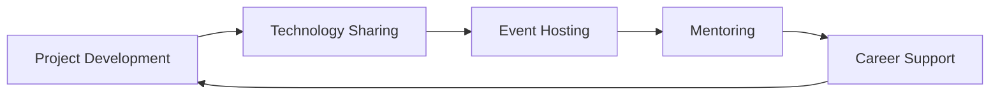
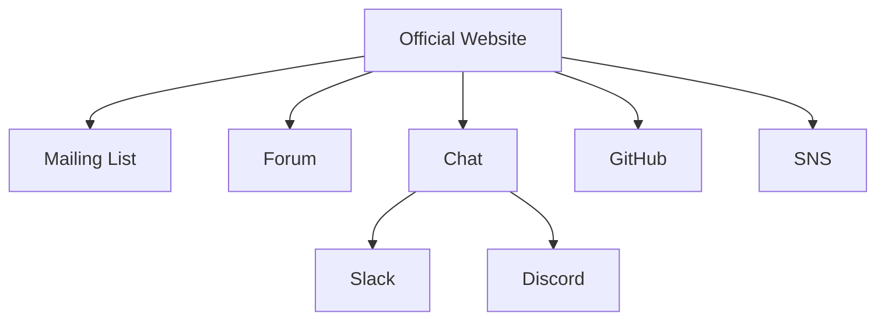

# CodeForge Community

!!! info "Community Objectives"
    CodeForge is a community where people who love AI and programming come together to support individual developers.

    Our goals are:

    - To create a space where members can freely exchange information and share ideas.
    - To support individuals developing apps and services.
    - To improve society through collaboration.
    - To support the skill development of each member.
    - To create and grow interesting projects.

    We aim to create an environment where people can contribute to society while having fun with technology.

## 🌟 Community Values

| Value        | Description                                          |
| :----------- | :--------------------------------------------------- |
| Creativity   | Welcoming new ideas and promoting innovative technology development |
| Autonomy     | Respecting the independence of members and supporting self-growth |
| Collaboration | Fostering a culture of mutual learning, cooperation, and support |
| Social Contribution | Solving social issues through technology         |
| Transparency | Open and fair community management                   |
| Diversity    | Respecting the individuality of members from all backgrounds |

## 💪 Activities

### Main Programs and Events

!!! example "Individual Development Support Program"
    We provide comprehensive support for individuals developing apps and services:

    - Expert advice on technical challenges
    - Design reviews and feedback
    - Consultation on marketing and deployment strategies
    - Project management support

!!! tip "AI Development Tool Sharing"
    We provide a platform for sharing the latest AI development tools and useful information:

    - How to use various APIs and implementation examples
    - Libraries of pre-trained AI models
    - Sharing of development datasets
    - Best practices and tips

!!! success "成果発表会・Demo Day"
    Held regularly, these presentation events offer opportunities for:

    - Project demonstrations
    - Feedback from the community
    - Matching opportunities with companies
    - Finding collaboration partners

??? abstract "Incubation for Individual Developers"
    Comprehensive support for developers aiming to commercialize their projects:

    - Business plan development support
    - Funding advice
    - Mentoring programs
    - Legal and accounting support for startups

!!! note "Matching with AI"
    We offer [optimal matching through AI](コミュニティー/aiマッチング.md):

    - Team formation based on skills and interests
    - Matching projects and developers
    - Exploration of collaboration opportunities
    - Mentor-mentee pairing

!!! example "Hackathons and Ideathons"
    Exploring new possibilities through regular event hosting:

    - Short-term intensive development events
    - Idea creation workshops
    - Team development experience
    - Prototype creation and presentation

## 🛡️ Community Guidelines

### Prohibited Activities

!!! danger "The following activities are prohibited"
    - Harassment
    - Discriminatory remarks
    - Copyright infringement
    - Fraudulent activities
    - Actions that disrupt community order

### Reporting and Consultation

!!! tip "In case of problems"
    1. Direct report to the management team
    2. Report on the management channel on Slack
    3. Use of the anonymous reporting system

## 🎓 Career Support

### Skill Development Support

??? abstract "Support Details"
    - Training cost subsidy (up to 100,000 points/year)
    - Support for participation in overseas conferences
    - Qualification acquisition support
    - Mentoring system
    - Technical book purchase subsidy

### Career Support

!!! example "Support Menu"
    1. Career counseling
    2. Skill assessment and development plan
    3. Resume and career history review
    4. Interview preparation
    5. Recommendation to partner companies

## 📝 How to Participate in Projects

### Participating as a Developer

!!! info "Steps to Participate in Development"
    - **GitHub Repository:** [Link to GitHub repository]
    - **Development Guidelines:** [Link to development guidelines]
    - **Issue Tracker:** [Link to issue tracker]
    - **Development Chat:** [Link to Slack channel]

### Participating as a Project Member

!!! example "Member Participation Requirements"
    - **Participation Requirements:** Technical skills, willingness to actively participate
    - **Roles:** Project management, public relations, design, community management
    - **How to Apply:** [Link to application form]
    - **Member ML:** [Link to mailing list]

### Participating as an External Developer

??? abstract "Information for External Developers"
    - **API Documents:** [Link to API documents]
    - **SDK:** [Link to SDK]
    - **Sample Code:** [Link to sample code]
    - **Contests/Hackathons:** [Link to event information]

### How to Participate as a General Member

| Participation Type | Method                     |
| :--------------- | :------------------------- |
| Idea Submission  | [Idea submission form]     |
| Feedback         | [Feedback form]            |
| Event Participation| [Event information page]   |
| Financial Support| [Donation page]            |
| SNS Sharing      | [SNS account]              |

## 📊 Project Progress

!!! note "Progress Check"
    - **Roadmap:** [Project roadmap]
    - **Activity Report:** [Activity report page]
    - **GitHub Activity:** [GitHub dashboard]

## 💬 Communication Channels

### Online Tools

### Regular Meetings

| Meeting           | Date & Time             | Purpose                     |
| :---------------- | :---------------------- | :-------------------------- |
| Monthly Meeting   | First Monday of each month, 19:00-20:00 | Progress check, issue sharing |
| Weekly Stand-up   | Every Wednesday, 10:00-10:15    | Status report, problem solving  |
| Open Session      | Anytime                 | Idea sharing, discussion      |
| Idea Pitch Day    | Last Friday of each month | New proposal solicitation   |

### Basic Rules of Communication

!!! tip "Basic Principles"
    1. **Openness:** Active participation in opinion exchange and discussion
    2. **Respect:** Constructive feedback, respect for diversity
    3. **Transparency:** Ensuring information sharing and accessibility

### Mechanisms for Eliciting Ideas

??? tip "How to Propose Ideas"
    - **Anonymous Submission Form:** [Link to anonymous form]
    - **Regular Brainstorming**
    - **Open Discussion**

### Decision-Making Process

!!! example "Project Decision-Making Flow"
    1. Submission of proposal (anyone can submit)
    2. Discussion in the community (1 week)
    3. Review by the management team
    4. Final decision and implementation

!!! success "🚀 To Future Innovators!"
    ### Your Ideas, to the Future with Innovative Technology

    CodeForge is **a platform for all challengers who create the future with AI and programming**.
    We are waiting for colleagues who create new value for society through technology.

    ### 💫 We welcome those with these "thoughts"

    - **🌍 I want to make society better!**
        - I want to solve social issues with the power of technology
        - I want to contribute to the creation of a sustainable future
        - I want to enrich people's lives with technology

    - **💡 I want to realize my ideas!**
        - I want to create innovative services
        - I want to shape my vision
        - I want to send new value to the world

    - **🤝 I want to grow with my colleagues!**
        - I want to meet colleagues who share the same aspirations
        - I want to learn from experienced mentors
        - I want to grow in an environment where we can stimulate each other

    - **🔧 Create the future with technology!**
        - I want to explore the latest AI technology
        - I want to contribute to the world with open source
        - I want to challenge the social implementation of technology

    ### 👋 Especially, we welcome young people and students!

    !!! success "To Young People and Students"
        - 🔥 **Passionate Young People**
            - Have the passion and energy to make society better
            - Want to challenge the creation of new value
            - Want to change the world with technology

        - 📚 **Students Who Want to Put Learning into Practice**
            - Want to practically apply the technology learned at school or by self-study
            - Want to gain experience in real projects
            - Want to connect theory and practice

        - 💫 **Creative Challengers**
            - Want to create something with their own technology
            - Want to feel the joy of shaping ideas
            - Want to grow with colleagues

    ### 🌟 We are waiting for you with these thoughts!

    !!! tip "Attitude and Mindset We Expect"
        - **💡 Innovator Orientation**
            - Deep interest in the latest AI technology (social implementation orientation)
            - Enthusiasm and initiative for service development (individual developers)
            - Holding a clear vision (individual developers)

        - **💪 Spirit of Challenge**
            - Perseverance to not give up when faced with difficulties
            - Inquisitiveness for new technologies
            - Challenging spirit that is not afraid of failure

        - **🤝 Community Spirit**
            - Attitude of valuing teamwork
            - Willingness to share knowledge with colleagues
            - Participation in open discussions

    ### ✨ Welcome Skills and Experience (Not Required)

    !!! note "Experience and Skills That Would Be Nice to Have"
        - **🏢 For those who are oriented towards social implementation**
            - Experience in social implementation projects
            - 実績 of collaboration with companies and local governments
            - 実績 of publishing papers and applying for patents

        - **💻 For individual developers**
            - Experience in developing apps and services
            - Knowledge of UI/UX design
            - Experience in business development

        - **🎓 For students and young people**
            - Experience participating in team development
            - Inquisitiveness for AI technology
            - Experience in open source activities

    !!! info "What We Value"
        We do not ask about technical level or experience.
        What we value is your

        - **🔥 "Passion"**
        - **💪 "Spirit of Challenge"**
        - **💫 "Empathy for CodeForge's Values"**

        です。

## 🔗 Participation-Related Links

### 💬 How to Participate

!!! tip "Discord Server"
    **A place for casual interaction**

    - Technical consultation via voice chat
    - Live coding sessions
    - Study sessions and mokumoku sessions
    - Chat and 交流space

    👉 [Join Discord](コミュニティー/discord_channels.md){.button-link}

!!! example "GitHub Organization"
    **Base for collaborative development**

    - Open source projects
    - Code sharing and review
    - Issue management
    - Pull requests

    👉 [Join Github](https://github.com/codeforge-community){.button-link}

!!! note "Twitter Community"
    **Follow the latest information**

    - Event announcements
    - Sharing of technical information
    - Introduction of member activities
    - Community updates

    👉 [Follow us](https://twitter.com/codeforge_jp){.button-link}

### 📚 Important Information
- [About Participation Qualifications](コミュニティー/参加資格.md)
- [Community Code of Conduct](コミュニティー/コミュニティ行動規範詳細資料.md)
- [Incentive Program](コミュニティー/インセンティブ制度.md)
- [AI Matching System](コミュニティー/aiマッチング.md)
- [AI Event Invitation](コミュニティー/aiイベント招待.md)

## ❓ Frequently Asked Questions

??? question "Is there a participation fee?"
    Basic participation is free. Separate fees may apply for some special events and programs.

??? question "Can beginners participate?"
    Yes, you can participate regardless of your technical level. We provide support for growth through mentoring and technical assistance.

??? question "Is online participation possible?"
    Yes, many activities can be participated in online. Offline events are also held as appropriate.

!!! note "Contact Us"
    For other questions and inquiries, please contact us at:

    - Email: [Email address]
    - Slack: [Workspace link]